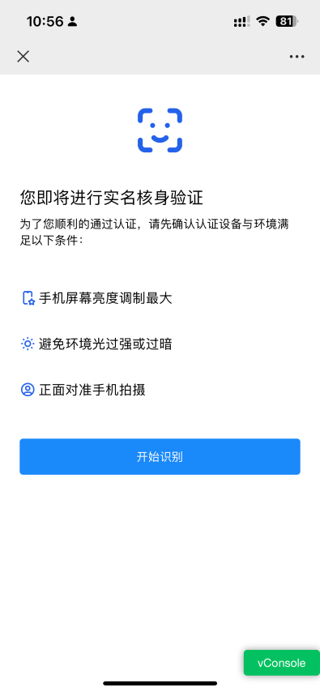
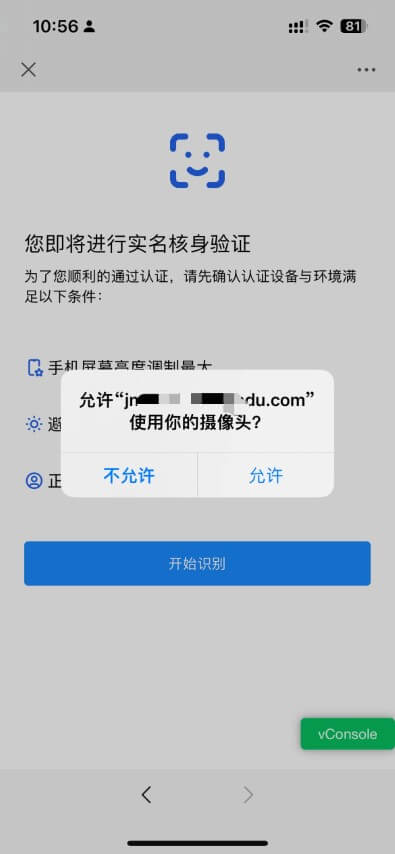
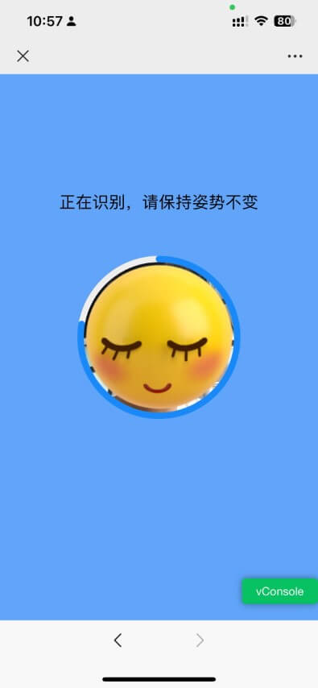

# 微信 h5 人脸识别 Demo

利用 [getUserMedia](https://developer.mozilla.org/en-US/docs/Web/API/Navigator/getUserMedia) 和 [tracking.js](https://trackingjs.com/) 实现调用摄像头并在页面内进行人脸识别

| 截图                                    |        |                                         |          |
| --------------------------------------- | ------ | --------------------------------------- | -------- |
|  | 入口页 |  | 授权弹窗 |
|  | 识别中 |  | 识别结果 |

## Demo


[https://facetest.kejun.me](https://facetest.kejun.me)

> 无服务器，不会收集你的信息，放心扫码测试
## 快速开始

```bash
pnpm install
pnpm dev
```

访问 http://localhost:3000

## 框架和库

- Nuxt3
- Vue3
- VueUse
- Vant
- Unocss
- tracking.js
- VConsole

核心代码在 [useFaceTrack.ts](./composables/useFaceTrack.ts) 中

## 测试设备

测试标准为能正确获取摄像头视频流，能使用 tracking 识别人脸，能在结果页展示人脸

测试时，必须使用 **https** 协议或者 `127.0.0.1`

作者条件有限，如果你也测试通过了，欢迎 PR 添加你的测试结果

- ✔️ 已通过
- ❌ 未通过
- ❓ 未测试

| 设备          | 微信     | QQ           | 企业微信        | 浏览器            |
| ------------- | -------- | ------------ | --------------- | ----------------- |
| iPhone 13 Pro | ✔️8.0.39 | ✔️8.9.58.612 | ✔️4.1.7(131309) | ✔️iOS 16.1 Safari |
